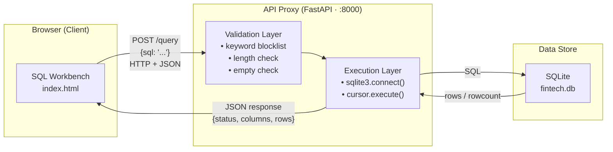
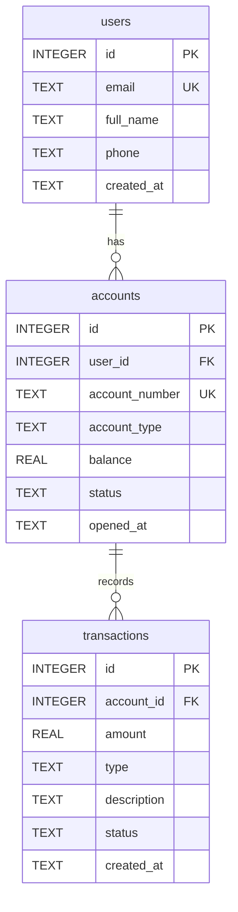

# Remote SQL Architect and Explorer

> Homework — Aprendizaje Automático para Grandes Volúmenes de Datos  
> Dr. Juan Carlos López Pimentel · Universidad Panamericana

A lightweight SQL Workbench that lets a user send raw SQL commands from a browser interface to a remote database through a RESTful API.

---

## Architecture



### Communication Flow

1. The user writes a SQL statement in the Workbench UI and clicks **Execute** (or presses `Ctrl+Enter`).
2. The frontend sends a `POST /query` request to the FastAPI server with the SQL string as a JSON body.
3. The **Validation Layer** checks the query before it touches the database:
   - Rejects empty or whitespace-only input.
   - Enforces a 2 000-character length limit.
   - Blocks dangerous keywords: `DROP`, `TRUNCATE`, `ALTER`, `ATTACH`, `DETACH`, `PRAGMA`, `LOAD_EXTENSION`.
4. If the query passes validation, the **Execution Layer** runs it against the SQLite database using Python's `sqlite3` module.
5. The server returns a unified JSON response:
   - **SELECT** → `{ status, columns, rows, rowcount }`
   - **INSERT / UPDATE / DELETE** → `{ status, message, rowcount }`
   - **Error** → `{ status, message }`
6. The Workbench renders the result as a dynamic table or displays the error in the status bar.

---

## Database Design

The schema follows **Third Normal Form (3NF)**:
- Every table has a single-column integer primary key → no partial dependencies.
- Every non-key attribute depends only on the primary key → no transitive dependencies.
- No repeating groups.

See [`schema.sql`](schema.sql) for the full DDL and [`seed.sql`](seed.sql) for mock data.

| Table | Description |
|---|---|
| `users` | Customer profiles — one row per person |
| `accounts` | Bank accounts — each user can have multiple (CHECKING, SAVINGS, INVESTMENT) |
| `transactions` | Financial movements on an account — CREDIT or DEBIT entries |

**Relationships:**
- `users` 1 → N `accounts` (via `accounts.user_id`)
- `accounts` 1 → N `transactions` (via `transactions.account_id`)



---

## Project Structure

```
remote-sql-workbench/
├── schema.sql          # DDL — CREATE TABLE with constraints and foreign keys
├── seed.sql            # DML — 10+ rows of mock data per table
├── erd.dbml            # ERD source code (paste at dbdiagram.io)
├── api/
│   ├── main.py         # FastAPI server — POST /query endpoint
│   └── requirements.txt
└── frontend/
    └── index.html      # Self-contained SQL Workbench UI
```

---

## Running Locally

**Requirements:** Python 3.10+

```bash
# 1. Install dependencies
cd api
pip install -r requirements.txt

# 2. Start the server
python3 main.py
# → Creates fintech.db and loads schema + seed data on first run
# → API available at http://localhost:8000
# → Docs at http://localhost:8000/docs

# 3. Open the Workbench
# Open frontend/index.html in your browser
```

### API Endpoint

| Method | Path | Body | Response |
|---|---|---|---|
| `POST` | `/query` | `{"sql": "..."}` | `{"status", "columns", "rows", "rowcount"}` |
| `GET` | `/health` | — | `{"status": "ok"}` |

### Example Queries

```sql
-- All customers
SELECT * FROM users;

-- Accounts per customer with balance
SELECT u.full_name, a.account_number, a.account_type, a.balance
FROM users u
JOIN accounts a ON u.id = a.user_id
ORDER BY a.balance DESC;

-- Total credits vs debits per account
SELECT a.account_number,
       SUM(CASE WHEN t.type = 'CREDIT' THEN t.amount ELSE 0 END) AS total_credits,
       SUM(CASE WHEN t.type = 'DEBIT'  THEN t.amount ELSE 0 END) AS total_debits
FROM accounts a
JOIN transactions t ON a.id = t.account_id
GROUP BY a.account_number;
```

---

## Security

| Threat | Mitigation |
|---|---|
| Destructive DDL (`DROP`, `TRUNCATE`, `ALTER`) | Keyword blocklist — rejected before reaching the DB |
| System access (`ATTACH`, `PRAGMA`) | Same blocklist |
| Oversized payloads | 2 000-character query limit |
| Empty input | Pydantic validator rejects blank strings |
| DB error leakage | `sqlite3.Error` caught; only sanitized messages returned |
| Cross-origin abuse | CORS restricted to `localhost` origins |
